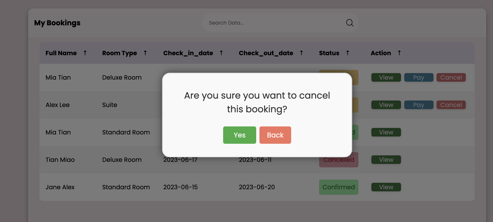

# Hotel-Management-System
This is a fully functional full-stack web application. The database was constructed using MySQL, while the website itself was developed using Python, Flask, HTML, CSS, and JavaScript. The website support user registration, login/logout capabilities, and the option to login using a Google account via the google-OAuth integration. To prioritize security, user passwords are hashed using bcrypt and stored securely in the database. The entire website is designed to be fully responsive and adjusts to different screen sizes. Users can easily search for available rooms and make bookings, with the option to include additional services if desired. Moreover, users can efficiently manage their bookings by processing payments or cancelling unconfirmed reservations. Additionally, there is a dedicated admin dashboard that enables administrators to efficiently oversee all bookings and hotel configurations.  
#### View the Website: http://miatian.pythonanywhere.com/

### Database ER Diagram  
  
------
#### Homepage
  
------
#### Customer dashboard
  
------
#### Login page
  
------
#### Sign up Page
  
------
#### Signin using Google account 
  
------
#### Book a room 
  
------
#### Bill Information
 
------

#### Notifications 
 

 
  
------
#### Dropdown 
 
 
------

